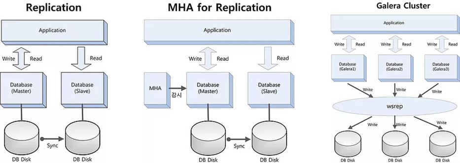

# 2021년 2월

## 1일 월요일

> _Real MySQL 공부_

- [7.5장 ~ 7.7장] INSERT, UPDATE, DELETE
  [링크](https://github.com/gazi-gazi/real-mysql/blob/main/7/7.5_7.7/7.5_7.7_jnsorn.md)
- AUTO_INCREMENT 값 가져오기 [링크](https://github.com/gazi-gazi/real-mysql/issues/51)
    - [ ] 나중에 사용자 변수 이용해서 비교해보자

## 2일 화요일

> _도메인 설계_

- 변경 가능성을 생각하면서 유연하게 설계하자
    - ~하면, 숫자와 같은 조건이나 정책들을 변경 가능하도록 설계
    - 확장성과 오버엔지니어링 : 추상화
        - 항상 이 둘의 적정선은 어디인가 고민했는데, 오늘 팀원분과 이야기를 통해 어느 정도 감을 잡았다.
        - 변경 가능한 것들을 추상화하여 설계를 하고 구체적인 타입은 추후 변경이 될 때 구현하도록 하자

- 문서화는 어디까지? : 구체성과 유지보수성(+유연성)의 타협점을 찾아서
    - 평소에 문서를 꼼꼼히 쓰는 편인데 오늘 생각이 많이 바꼈다.
    - 항상 뒤로 갈수록 문서 관리가 잘 안되는 이유는 변경 가능성이 높은 내용에 대해 너무 구체적으로 적어서 그랬던 것!
    - API와 DB같은 것들은 언급이 되어 있으면 개발할 때 사고가 닫힐 수 있기 때문에 최대한 지양하고 시나리오 정도만 적어두자

## 4일 목요일

[그런 REST API로 괜찮은가](../web/그런_REST_API로_괜찮은가.md) 정리

## 5일 금요일

> 오픈소스 DBMS로 고가용성 확보하기 - MySQL 이중화 구성 방안 
> [(링크)](https://www.2e.co.kr/news/articleView.html?idxno=204172)

### Replication

- 데이터를 읽고 쓰고 할 수 있는 Leader DB와 읽기 전용인 Follower DB 구조
- Leader DB의 Binary log를 읽어서 Follower DB의 Relay log로 복사 후 반영하여 변경된 데이터를 동기화 함
    - 실시간 동기화가 아니며 Asynchronous 방식과 Semi-Sync 방식으로 구성 가능
    - Follower 대수에 따라 수 초의 Delay가 발생할 수 있음(지연 시간)
    - 실시간이 매우 중요한 데이터 읽기 트랜잭션은 Leader DB에서 읽게 하고 Follower DB는 이외 읽기 트랜잭션을 적용
    

- Leader가 하나이기 때문에 Standby Leader – Follower 를 별도로 두고 CDC(Change Data Capture) 같은 솔루션으로 데이터 동기화 
  시킨 후 장애가 발생하면 Leader를 대체하는 방식을 사용하거나, Leader가 fault 나면 Follower를 Leader로 승격시키는 방식을 적용한다

### MHA for replication

- MHA : MySQL High Availability
- MMM : Multi Master Replication Manager
  

- Leader의 상태를 실시간으로 감시하고 있다가 장애가 발생하면 순서에 의해 해당 Follower를 Leader로 자동 승격 시킴
- Passive Leader를 두고 평상시에는 Read only DB로 사용하다 장애 시 MMM가 자동 인식하여 Active Leader로 변경하고 Follwer를 이동 
  종속시키는 방식도 적용 가능
  

- MHA, MMM 등은 이중화가 안되는 단점이 있어 MHA등의 장애 시 실시간 감시에 어려움발생
- MHA는 별도의 서버에 두어야 하드웨어, 운영체제의 문제 발생 시에도 DBMS를 감시할 수 있다. 

### Galera Cluster

- Synchronous 방식으로 동작하는 다중 리더 클러스터
- 2개 이상의 Multi Leader를 두고 wsrep API를 통하여 실시간으로 데이터를 동기화 할 수 있음
- 특정 노드 장애 시 자동으로 해당 노드를 제거할 수 있고 HAProxy를 같이 적용하면 소프트웨어 기반의 부하 분산을 통하여 성능을 개선할 수 있음

#### 용어

- U2L : Unix to Linux
- CIO : Chief Information Officer
- RAC : Real Application Cluster

