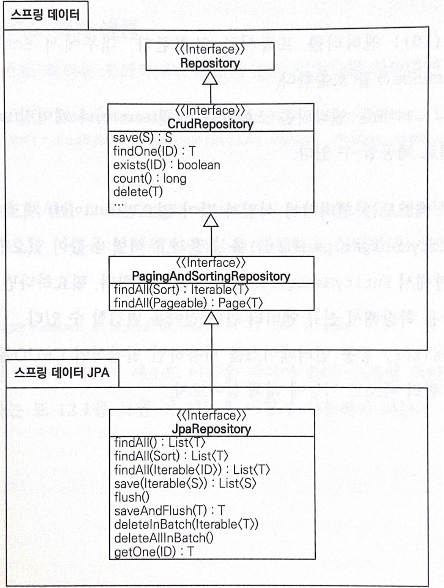
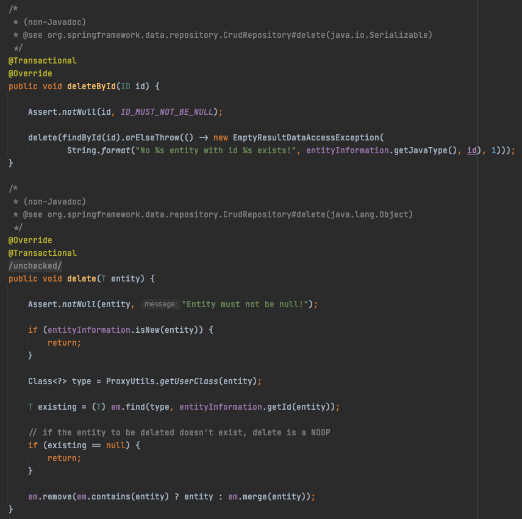

# 2021년 1월
## 6일 수요일
> _Limit Offset 성능 이슈_

```sql 
SELECT * FROM a LIMIT 500 OFFSET 5000 
```

- 5000개의 row를 건너뛰고 500개의 row를 읽어서 반환할 것 같지만 실제로는 5000개의 row를 읽어서 버리고, 그 뒤에 500개를 반환함
  - 따라서 OFFSET이 커질 수록 부담됨
  - 실제 인텔리제이에서 맨 끝으로 가는 화살표를 누르면 테이블의 row갯수-500개만큼 OFFSET이 설정됨
    - 즉 전체 테이블을 한 번에 읽게 됨
  - 이런 이슈는 데이터가 적으면 별 문제 없겠지만, 10만개 쯤 넘어가면 좀 많이 느리고 더 크면 문제가 됨
- 따라서 LIMIT OFFSET보다는 별도의 조회 조건을 둬서 페이징 하는 게 나음
  - `ORDER BY id LIMIT 500` 해놓고 다음 요청때는 마지막으로 응답한 id값을 같이 받도록 해서 `WHERE id > 요청받은 id ORDER BY id LIMIT 500` 이런식으로 하는 게 낫다.
  - 이렇게 되면 조회랑 정렬조건 칼럼이 인덱스를 잘 타면 속도가 일정해짐
    - LIMIT OFFSET은 뒤쪽 데이터를 조회할수록 느리지만 WHERE id > 요청받은 id ORDER BY id LIMIT 500 요런 형태의 쿼리는 읽는 row 숫자가 비교적 일정해서 뒤쪽 데이터를 조회하든 앞에 있는 데이터를 조회하든 속도가 비슷함

## 8일 금요일
> _Reactive Programming_

비동기 블록킹 프로세스로 동작하는 애플리케이션을 논블럭킹 프로세스로 동작하기 위해서 지원하는 프로그래밍

## 13일 수요일
> _JUnit Fixture_

모든 테스트 케이스에서 공통적으로 사용하는 오브젝트

- 모든 테스트에서 공유하는 오브젝트가 아님
- 독립적이고 언제 실행될지 모름
- 한 테스트에서 수행된 개체의 변경 사항은 다른 테스트에서 공유되지 않음
- 목적: 테스트의 코드 중복 제거
#### Ref 
- [공식 문서](https://junit.org/junit5/docs/current/user-guide/)

## 21일 목요일, 22일 금요일
> _"SpEL과 condition을 이용해서 분기문을 제거해주세요."_
### SpEL(Spring Expression Language)
- 런타임에 객체 그래프를 쿼리하고 조작하는 것을 지원하는 표현 언어
- 언어 구문은 Unified EL과 비슷하지만 추가로 메소드 호출과 기본적인 문자열 템플릿 기능을 제공함
- SpEL은 기술에 구애받지 않는 API를 기반으로 하고 있어 필요하다면 다른 표현 언어 구현을 통합할 수 있음
    - 스프링과 직접 연계되지 않아 독자적으로 사용가능
#### Ref
- [공식 문서](https://docs.spring.io/spring-framework/docs/3.0.5.RELEASE/reference/expressions.html)

## 24일 일요일
> _Real MySQL 스터디 준비_

## 3️⃣ 회고(18일~24일)
- 코드를 볼수록 `DDD Start!` 읽고 싶다. 플랜을 짜봐야겠다.
- 코딩할 때 책을 엄청 보게된다. 특히 이펙티브자바랑 클린코드를 자주 살펴보게 되는데 목차를 달달 외워서 인덱스를 만들어놔야겠다(ㅋㅋ) 아무튼 그래서 책장을 책상 옆으로 옮겼다. 훨씬 편하다.
- 깃허브 에디터 못쓰겠다. 웹에서 markdown 작성하다보면 글이 여기 날아다니고 저기 날아다니고 난리가 난다. 에디터 좀 고쳐주세요...
    - 추가로 지라랑 노션도 ☹️.. 지라는 이펙트 적용이 이상하게 되고 노션은 list에 첫 단어를 이모지로 쓰면 그 다음 커서부터는 먹통이 된다.

## 25일 월요일
> _노트북 초기 세팅 및 API 문서 작성_

## 26일 화요일
> _Elastic Beanstalk_

Paas의 일종으로 Docker 컨테이너를 기반으로 애플리케이션을 쉽게 배포하고 운영 및 관리 할 수 있도록 도와주는 AWS 서비스

#### 배포관리
- S3에 저장된 소스코드로 버전관리 `eb deploy`
- 언제 어떤 코드가 배포되었는지 파악하기 쉬움
- 롤백 역시 예전 버전을 누른 후 deploy만 누르면 됨

#### 운영
- 오토 스케일링이 편함
  - 빈스톡 설정 값에서 CPU 혹은 메모리가 일정 이상을 사용하는 경우 인스턴스를 늘리도록 설정할 수 있음
  - 갑자기 트래픽이 몰려도 빈스톡이 알아서 스케일업을 해주며 트래픽이 빠지면 알아서 스케일인을 해줌
  
#### 로그
- 알아서 로그를 S3에 저장한다

#### 모니터링 
- 서버에 문제가 발생한 경우 별도의 알림을 설정할 수 있다(SNS)

## 27일 수요일
> 새로운 티켓를 위한 도메인 공부

## 28일 목요일
> _Grafana_

- 클라우드 모니터링 서비스
- 메트릭 데이터 시각화, 대시보드 구성
- 외부 데이터 소스를 정의하고 해당 데이터 소스에 쿼리를 통해 데이터를 동적으로 가지고 와서 시각화

> _개발하며 궁금했던 점들: Spring Data JPA_
- 데이터 접근 계층 개발 시 구현 클래스 없이 인터페이스만 작성해도 기능을 구현할 수 있음


  
### 쿼리 메소드 기능
  - 메소드 이름으로 쿼리 생성
  - 메소드 이름으로 JPA NamedQuery 호출
  - @Query 어노테이션을 사용해서 리포지토리 인터페이스에 쿼리 직접 정의 


### 인자로 Entity를 넘겨줄까 id를 넘겨줄까?
- id로 값을 주어도 내부에서 findById를 통해 엔티티를 찾아온다. 그러니 엔티티를 알고 있을 땐 엔티티를 넘겨주자.




### find vs get
#### find
- 내부에서 EntityManager.find() 호출
```java
  /**
   * Retrieves an entity by its id.
   *
   * @param id must not be {@literal null}.
   * @return the entity with the given id or {@literal Optional#empty()} if none found.
   * @throws IllegalArgumentException if {@literal id} is {@literal null}.
   */
  Optional<T> findById(ID id);
```
  
#### get
- 프록시로 조회
- 내부에서 EntityManager.getReference() 호출
  
```java
  /**
  * Returns a reference to the entity with the given identifier. Depending on how the JPA persistence provider is
  * implemented this is very likely to always return an instance and throw an
  * {@link javax.persistence.EntityNotFoundException} on first access. Some of them will reject invalid identifiers
  * immediately.
  *
  * @param id must not be {@literal null}.
  * @return a reference to the entity with the given identifier.
  * @see EntityManager#getReference(Class, Object) for details on when an exception is thrown.
  */  
  T getOne(ID id);
  ```  
