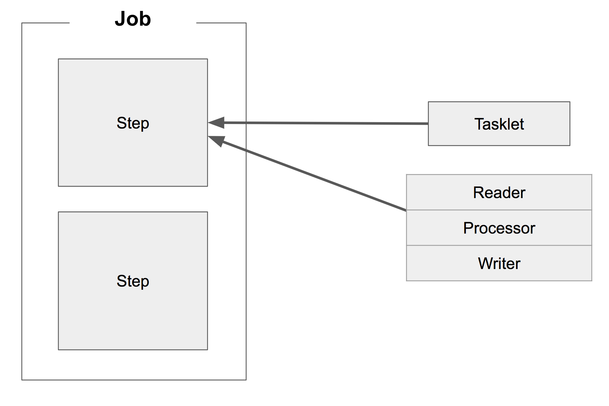

> 1. Spring Batch 가이드 - 배치 어플리케이션이란?  [(기억보단 기록을)](https://jojoldu.tistory.com/324?category=902551)

### 배치 애플리케이션의 조건

- `대용량 데이터` : 대량의 데이터를 가져오거나, 전달하거나, 계산하는 등의 처리를 할 수 있어야 합니다.
- `자동화` : 심각한 문제 해결을 제외하고는 사용자 개입 없이 실행되어야 합니다.
- `견고성` : 잘못된 데이터를 충돌/중단 없이 처리할 수 있어야 합니다.
- `신뢰성` : 무엇이 잘못되었는지를 추적할 수 있어야 합니다.(로깅, 알림)
- `성능` : 지정한 시간 안에 처리를 완료하거나 동시에 실행되는 다른 어플리케이션을 방해하지 않도록 수행되어야 합니다.

## Spring Batch?

- Reader : 데이터를 읽어오는 모듈
- Writer : 데이터를 쓰는 모듈

- 현재 Spring Batch 4.0(Spring Boot 2.0)에서 지원하는 Reader & Writer 

|DataSource|기술|설명| 
|---|---|---|
|DB|JDBC|페이징, 커서, 일괄 업데이트 등 사용 가능|
|DB|Hibernate|페이징, 커서 사용 가능|
|DB|JPA|페이징 사용 가능(현재 버전에선 커서 없음)|
|File|Flat file|지정한 구분자로 파싱 지원|
|File|XML|XML 파싱 지원|

## Quartz
- Quartz : 스케줄러
- Batch : 대용량 배치 처리에 대한 기능 지원
- 따라서 둘이 조합해서 많이 사용함
- 정해진 스케줄마다 Quartz가 Spring Batch를 실행하는 구조

> 2. Spring Batch 가이드 - Batch Job 실행해보기 [(기억보단 기록을)](https://jojoldu.tistory.com/325?category=902551)

## Batch Job

- Spring Batch에서 Job은 하나의 배치 작업 단위를 이야기 함
- Job은 여러개의 Step으로 이루어져있음
- Step은 Tasklet 혹은 Reader&Processor&Writer 묶음이 존재
    - Tasklet : Spring MVC의 @Component, @Bean과 비슷한 역할이라고 생각해도 됨,
    명확한 역할은 없지만 개발자가 지정한 커스텀한 기능을 위한 단위로 보면 됨 (아직 이해 안감)
      

## Spring Batch의 메타 데이터

- 이전에 실행한 Job이 어떤 것들이 있는지
- 최근 실패한 Batch Parameter가 어떤 것들이 있고, 성공한 Job은 어떤 것들이 있는지
- 다시 실행한다면 어디서부터 시작하면 될 지
- 어떤 Job에 어떤 Step들이 있었고, Step들 중 성공한 Step과 실패한 Step들은 어떤 것들이 있는지

이 외에 Batch 어플리케이션을 운영하기 위한 메타데이터를 여러 테이블에 나누어 저장함

- 기본적으로 H2 DB를 사용할 경우엔 해당 테이블을 Boot가 실행 시 자동으로 생성해줌
- MySql이나 Oracle은 개발자가 직접 생성
  - 스키마는 Spring batch에 이미 존재 (schema-mysql.sql)
  
> 3. Spring Batch 가이드 - 메타테이블 엿보기 [(기억보단 기록을)](https://jojoldu.tistory.com/326?
     > category=902551)

### BATCH_JOB_INSTANCE
- Job Parameter에 따라 생성되는 테이블
  - Job Parameter : Spring Batch가 실행될 때 외부에서 받을 수 있는 파라미터
  - 같은 Batch Job이라도 Job Parameter가 다르면 BATCH_JOB_INSTANCE에는 기록되며, 
    Job Parameter가 같다면 기록되지 않음
      - 동일한 Job Parameter로 성공한 기록이 있을 때 JobInstanceAlreadyCompleteException 발생
  
- JOB_INSTANCE_ID : BATCH_JOB_INSTANCE 테이블의 PK
- JOB_NAME : 수행한 Job Name

### BATCH_JOB_EXECUTION
- JOB_EXECUTION과 JOB_INSTANCE는 부모-자식 관계
- JOB_EXECUTION은 자신의 부토 JOB_INSTANCE가 성공/실패했던 모든 내역을 갖고 있음

